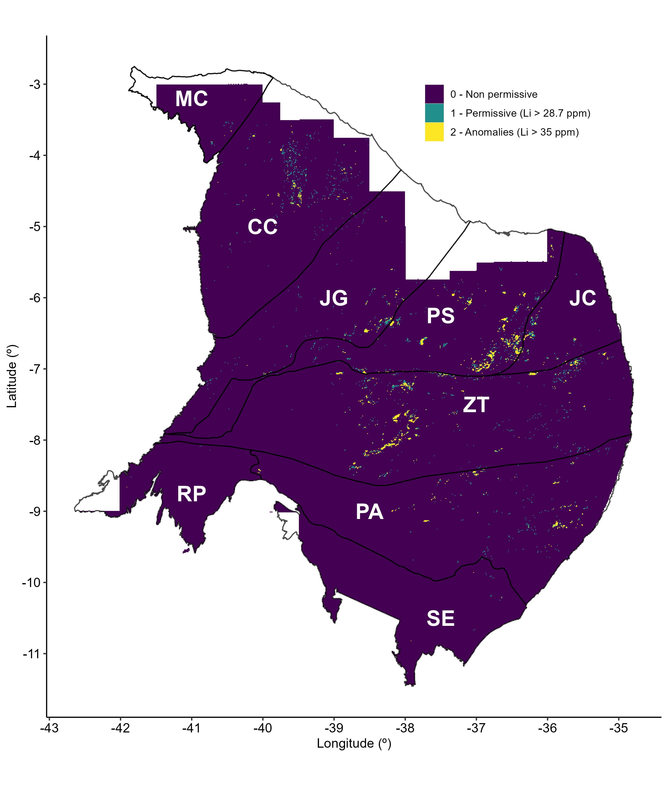

Preprint:  

## Enhancing Lithium Exploration in the Borborema Province, Northeast Brazil: Integrating Airborne Geophysics, Low-Density Geochemistry, and Machine Learning Algorithms

The models have been developed by researchers of the [Geological Survey of Brazil](https://www.cprm.gov.br/en/) (SGB/CPRM)

## Abstract

The increasing demand for lithium, driven by its essential role in renewable energy technologies, implies the development of innovative exploration techniques. This study applies Random Forest regression integrated with low-density geochemistry and airborne gamma-ray data to enhance the resolution and accuracy of lithium concentration maps in soils across the Borborema Province, North-east Brazil. Our methodology not only refines the mapping of lithium distributions but also identifies potential lithium-rich zones within established and underexplored areas. The predictive model successfully delineates regions with high lithium content (up to 70 ppm), aligning these with known geological features and pegmatite occurrences, thereby validating the model's robustness despite some challenges in predicting extreme values. The research highlights the presence of lithium beyond traditional pegmatite deposits, suggesting a broader geological context for lithium mineralization. Our findings encourage strategic targeting of exploration efforts, which can lead to more economical mining practices. This study demonstrates the potential of integrating advanced data analytics with traditional geological methods to improve the efficiency and reach of lithium exploration, supporting the global transition towards renewable energy sources. Future work should enhance model accuracy, especially at extreme concentration levels, and expand the model's application to other regions with similar geological settings.

Additional information about the building process is available on the internet in the [preprint file](https://www.researchsquare.com/article/rs-5066453/v1) (original manuscript still not certified by a peer review).
 
## Status

This model is finished and submitted to a peer review journal.

## Training Data

The directory [data](./data) contains all data considered for the models' building. The raw data supporting this study, including the Geochemistry, Airborne Geophysics, and Pegmatite datasets, are openly available in the Geological Survey of Brazil Data Repository, accessible at https://geosgb.sgb.gov.br/. 

## Building:

Project Developed on R.

## Contributors

* [Guilherme Ferreira da Silva](http://lattes.cnpq.br/3088062889595212), (E-mail: guilherme.ferreira@sgb.gov.br)
* Raphael Teixeira Correa
* Rogério Celestino de Almeida

## Copyright and License

The source code for this work is licensed based on the GNU GENERAL PUBLIC LICENSE, see [LICENSE](LICENSE).
